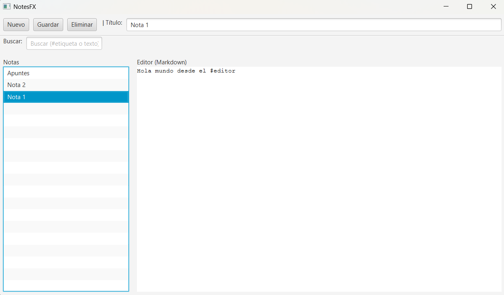

# NotesFX

**Bloc de notas de escritorio en JavaFX + SQLite**

## Descripción

NotesFX es una aplicación de escritorio para tomar y gestionar notas en formato Markdown. Utiliza JavaFX para la interfaz de usuario y SQLite con FTS5 para búsqueda rápida por texto y etiquetas.

## Características principales

- **Crear**, **editar** y **eliminar** notas.
- **Búsqueda** por palabra clave o etiqueta (`#tag`).
- **Etiquetas** extraídas automáticamente del contenido.
- **Persistencia** con SQLite y virtual table FTS5.
- **RichTextFX** como editor Markdown.

## Requisitos

- Java 21
- Gradle 8.8+

## Instalación y ejecución

1. Clona el repositorio:
   ```bash
   git clone https://github.com/tu-usuario/notesfx.git
   cd notesfx
   ```
2. Compila y ejecuta con Gradle:
   ```bash
   ./gradlew run
   ```

## Estructura del proyecto

```
notesfx/
├── src/
│   └── main/
│       └── java/com/regdevs/notesfx
│           ├── MainApp.java
│           ├── ui/MainView.java
│           ├── model/Note.java
│           └── storage/ (Database, Repository, etc.)
├── build.gradle.kts
└── README.md
```

## Captura de pantalla



## Futuras mejoras

- Vista previa en vivo de Markdown.
- Temas claro/oscuro.
- Exportar/importar notas.
- Empaquetado con `jpackage`.

## Licencia

Proyecto bajo la licencia MIT.

